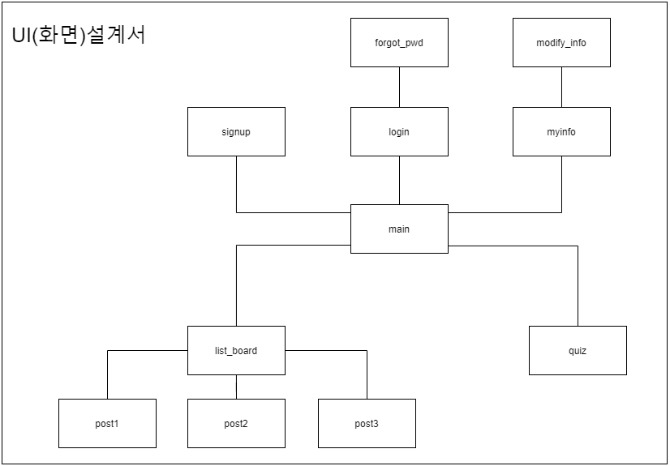
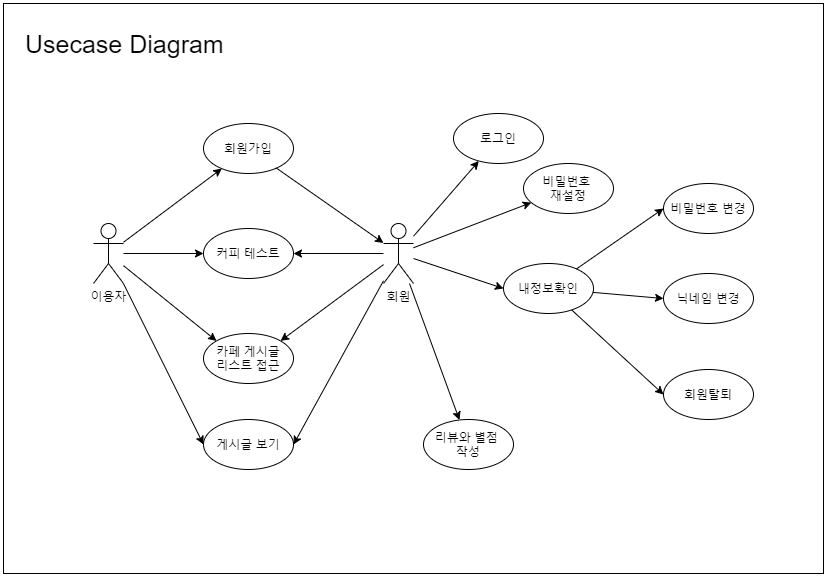
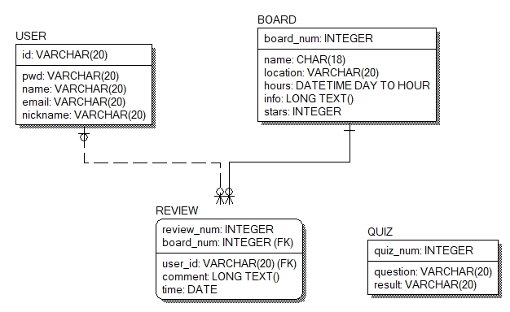

# WalkToCafe(UOS)

## 시나리오
이용자는 main 페이지(lookatcamap.herokuapp.com)에 접속한다.    
sign_up 페이지로 이동하여 회원가입을 진행하면, 웹 회원이 된다.    
회원이면, 게시판에 리뷰를 남길 수 있다. 이용자이면 그렇지 않다.    
회원, 이용자 모두 리뷰 읽기는 가능하다.    

이용자가 회원인 경우, login 페이지로 이동하여 로그인한다.     
이때 비밀번호를 잃어버린 경우, forgot_pwd 페이지로 이동하여 비밀번호 재설정을 실행한다.    
회원인 상태에서 main 페이지에 접속하면 myinfo 페이지로 접속가능하다.   
 
myinfo 페이지에서 회원은 닉네임과 비밀번호를 변경가능하다.    
또한 회원탈퇴 기능도 있다.   

list_board 페이지에서 카페에 관한 게시글의 리스트를 확인한다.   
원하는 카페 위치, 분위기, 음료 메뉴와 가격 등을 참고하여 원하는 게시글(ex) post1)로 접속한다.   
게시글은 간단한 카페 정보와 카페 이미지를 포함하고 있다.    
또한 별점과 리뷰는 회원들의 추가 기록으로 포함된다.   

(베타버전) quiz 페이지에서 이용자는 카페나 커피 관련 테스트를 참여한다.    
이용자의 MBTI 테스트 결과를 바탕으로 이용자의 적합한 커피를 추천한다.   

아직, lookatcamap 혹은 camap인 것은 계속해서 업데이트가 진행중이기 때문이다. _조금만 기달리자_   

## UI(화면) 설계서

## Usecase Diagram

## 프로세스 명세서
_뭐적냠?_
- 로그인 따로 구현X -> Oauth만 활용하는 방안(네이버, 카카오, 구글)
- 댓글 신고 기능(추후 기능)
- 로딩 화면 구현(추후 기능)
- 관리자(Admin) 페이지 구현(추후 기능)

## ERD
